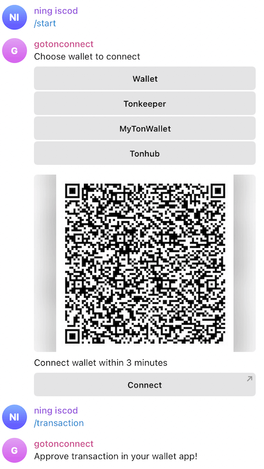

# ton-connect-bot

A simple bot written on Goland to interact with TON wallets using Ton Connect protocol

The running public instance can be found at https://t.me/test_tonconnect_bot

if you use python https://github.com/yungwine/ton-connect-bot

## How to launch

### Redis
If you want to use permanent TON Connect storage you should [set up Redis](https://redis.io/docs/getting-started/) or any other database.

## Test Bot

[gotonconnect](https://t.me/gotonconnect_bot)

[](https://t.me/gotonconnect_bot)

### Install dependencies:

```bash
git clone https://github.com/iscod/ton-connect-bot.git

```

### Set up `.env`:

```dotenv
TOKEN='1111:ABCD'  # your bot token here
MANIFEST_URL='https://raw.githubusercontent.com/XaBbl4/pytonconnect/main/pytonconnect-manifest.json'
```

### Run bot

```python
cd ton-connect-bot
go run src/main.go
```